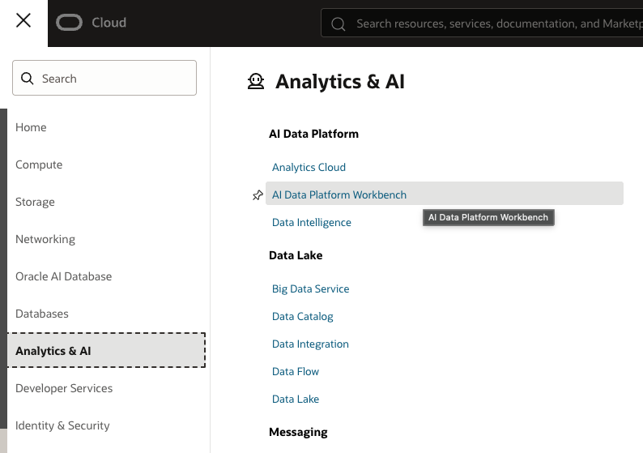

# Criar um Oracle AI Data Platform Workbench

## Introdução

Neste laboratório, você criará um **Oracle AI Data Platform Workbench**, ambiente da Oracle Cloud voltado para profissionais de dados que precisam catalogar, ingerir, transformar, analisar e operacionalizar dados em pipelines analíticos.

O Oracle AI Data Platform Workbench fornece a plataforma e o framework necessários para desenvolver fluxos de dados, trabalhar com catálogos, conectar fontes internas ou externas, desenvolver código em notebooks, executar workflows e integrar recursos de IA e machine learning.

No contexto deste laboratório, o AIDP será o ambiente central de processamento e organização dos dados. Ele será utilizado para executar notebooks PySpark, ingerir dados do PostgreSQL, criar tabelas Delta nas camadas Bronze e Silver e preparar os dados para publicação na camada Gold.

> Referência: [Oracle AI Data Platform Workbench](https://docs.oracle.com/en/cloud/paas/ai-data-platform/)

### Objetivos

* Criar um Oracle AI Data Platform Workbench
* Criar um workspace no AIDP
* Criar um cluster compute para execução dos notebooks
* Preparar o AIDP para o fluxo de ingestão, transformação e publicação dos dados

## Tarefa 1: Criar um Oracle AI Data Platform Workbench

Siga a sequência abaixo para criar o **Oracle AI Data Platform Workbench** pela Console da OCI.

1. Acesse o menu **Analytics & AI** e selecione **AI Data Platform Workbench**.

    

2. Selecione o compartimento correto e clique em **Create AI Data Platform Workbench**.

    

3. Informe o nome e a descrição do Workbench. Na mesma tela, defina também o nome e a descrição do workspace inicial.
Obs.: O workspace criado junto com o AIDP serve somente para o funcionamento da ferramenta e não é uma boa prática utilizá-lo para os pipelines reais.

    

4. Configure a integração com o Oracle Autonomous AI Lakehouse como "None" para este LAB.

    

5. Para trabalhar com agentes de IA selecione "Create New" e informe as credenciais necessárias para a configuração do Oracle Autonomous AI Lakehouse.

    

6. Revise e adicione as políticas de acesso que serão criadas ou associadas ao Workbench.

    

7. Aguarde até que o Workbench apareça na lista e acompanhe o status de criação.

    

8. Acesse o menu de ações e selecione **View Details** para revisar os detalhes do ambiente que está sendo criado.

9. Na tela de detalhes, confirme as informações gerais do Workbench, os recursos associados e o andamento da work request de criação do AIDP.

## Tarefa 2: Criar workspace

1. Na lista de **AI Data Platform Workbenches**, confirme que o Workbench está com status **Active** e acesse o recurso criado.

    

2. No ambiente do Workbench, acesse a página inicial para visualizar os recursos disponíveis.

    

3. No menu lateral, selecione **Workspaces** e clique em **Create Workspace**.

    

4. Informe o nome, a descrição, o catálogo padrão e as configurações de rede do workspace.

    

5. Acompanhe o status de criação do workspace até que o provisionamento seja concluído.

    

6. Confirme que o workspace aparece com status **Active** e clique no nome do workspace criado para selecioná-lo.

    

## Tarefa 3: Criar cluster compute

1. No menu lateral do workspace, selecione **Compute**.

    

2. Na tela de **Compute**, clique na opção para criar um novo cluster.

    

3. Informe o nome, descrição, runtime, driver, worker shape, OCPUs, memória e storage do cluster.

    

4. Configure a quantidade de workers, a política de encerramento automático e as opções avançadas, quando necessário.

    

5. Após a criação, confirme que o cluster compute aparece na lista com as informações de runtime e capacidade.

    

## Conclusão

Nesta etapa, você criou o **Oracle AI Data Platform Workbench**, configurou um workspace e preparou um cluster compute para executar os notebooks do laboratório. Com esses recursos disponíveis, o ambiente passa a contar com a base necessária para desenvolvimento em notebooks, gerenciamento de dados, integração com fontes externas e execução de pipelines analíticos.

Nas próximas etapas, esse workspace será utilizado para conectar o PostgreSQL, executar os notebooks PySpark e organizar os dados nas camadas Bronze, Silver e Gold, formando o pipeline de dados de ponta a ponta proposto pelo laboratório.

## Autoria

- **Autores** - Adriano Tanaka, Fábio Silva
- **Último Updated Por/Data** - Fábio Silva, Jul/2026
