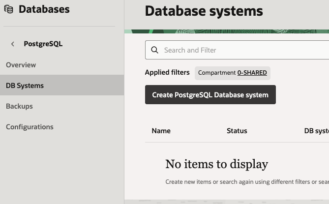
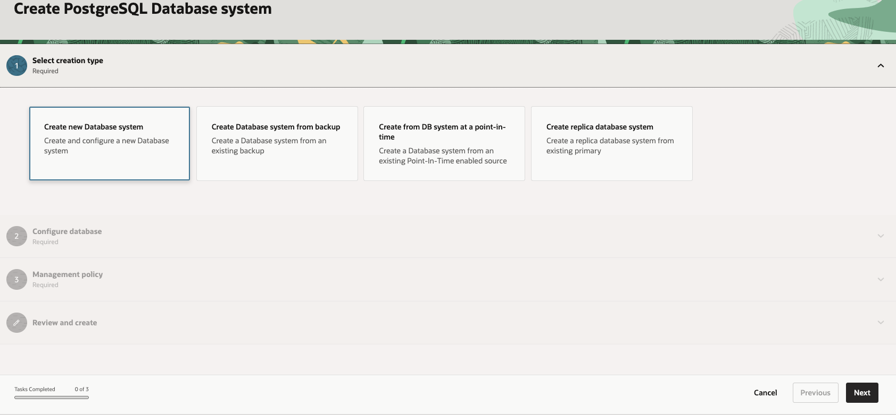
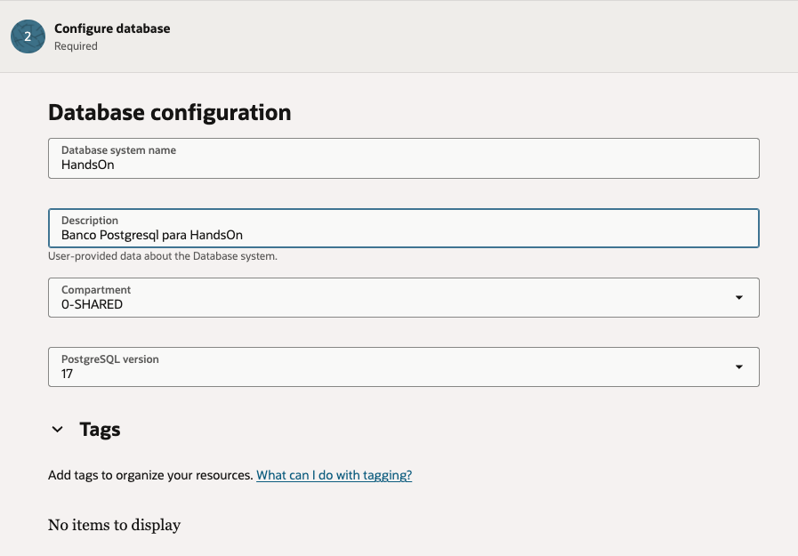
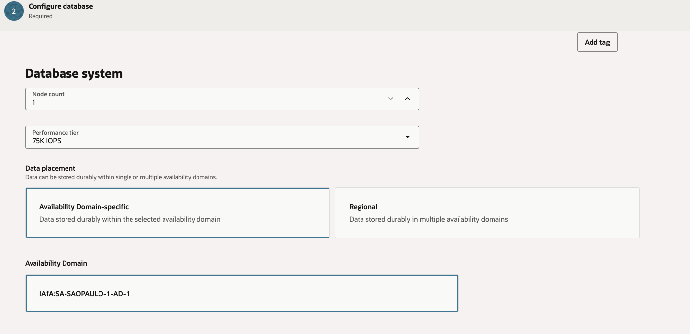
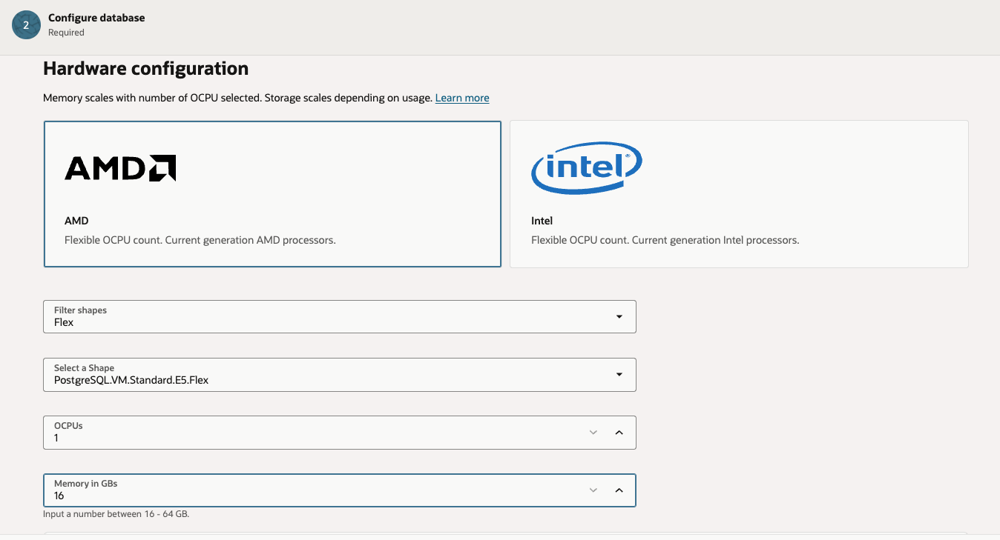
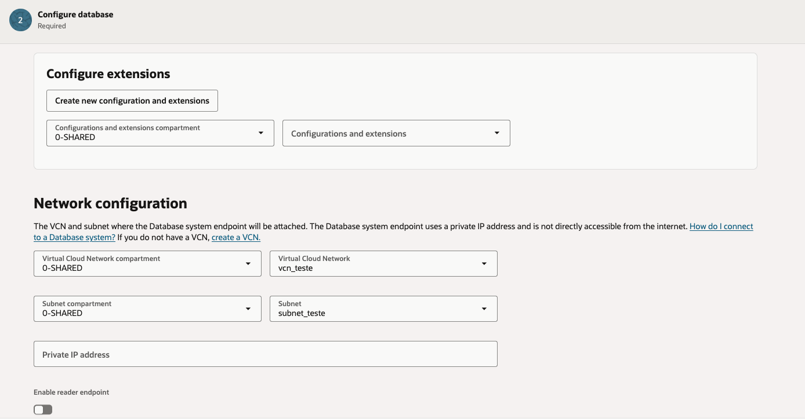
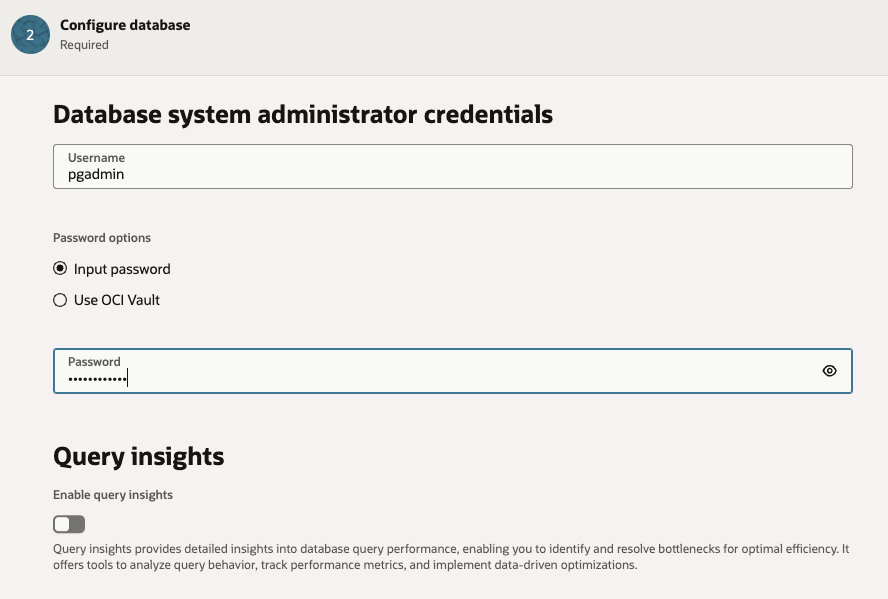
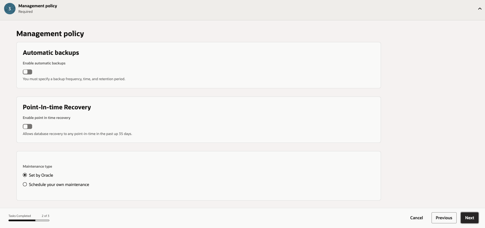
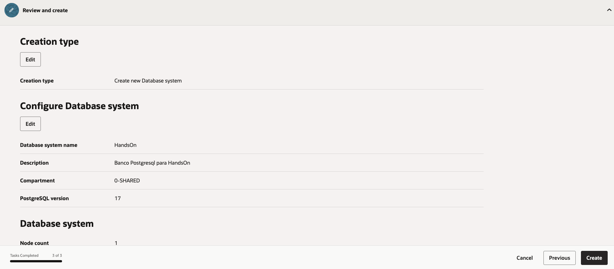
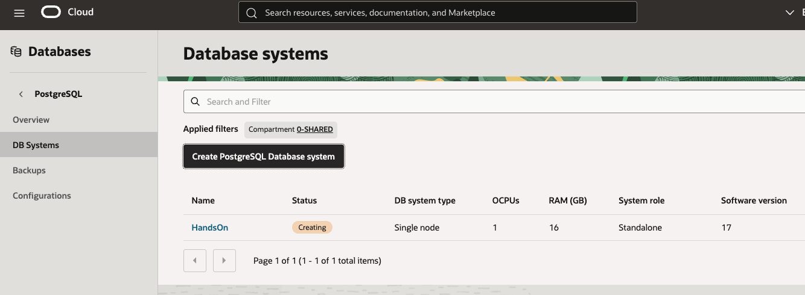

# Criar um OCI Database with PostgreSQL

## Introdução

Neste laboratório, você criará um **OCI Database with PostgreSQL**, serviço gerenciado da Oracle Cloud Infrastructure compatível com PostgreSQL. Esse serviço permite provisionar um sistema de banco de dados PostgreSQL na OCI com recursos administrados de infraestrutura, armazenamento, alta disponibilidade, backups e manutenção.

O OCI Database with PostgreSQL utiliza armazenamento otimizado para banco de dados, com dimensionamento dinâmico conforme as tabelas são criadas e removidas. Os dados são criptografados em trânsito e em repouso, e o serviço pode ser acessado e administrado pela Console da OCI, CLI, SDKs ou APIs REST.

No contexto deste laboratório, o PostgreSQL será utilizado como base para armazenar dados transacionais e apoiar o fluxo de ingestão e publicação de dados analíticos. Ao final da atividade, você terá um ambiente PostgreSQL provisionado na OCI e pronto para ser usado pelas próximas etapas do laboratório.

> Referência: [Visão Geral do OCI Database with PostgreSQL](https://docs.oracle.com/pt-br/iaas/Content/postgresql/overview.htm)

### Objetivos

* Criar um OCI Database with PostgreSQL

## Task 1: Criar um OCI Database with PostgreSQL

Siga a sequência abaixo para criar o serviço **OCI Database with PostgreSQL** pela Console da OCI.

1. Acesse o menu do serviço PostgreSQL e, em **DB Systems**, clique em **Create PostgreSQL Database system**.

    

2. No assistente de criação, mantenha a opção para criar um novo database system.

    

3. Informe o nome do banco de dados, a descrição, o compartimento e a versão do PostgreSQL.

    

4. Configure o tipo do sistema de banco de dados, o sistema e a disponibilidade.

    

5. Selecione a configuração de hardware, incluindo processador, shape, OCPUs e memória.

    

6. Configure a rede, selecionando VCN, sub-rede e opções de endpoint privado.

    

7. Defina as credenciais do administrador do banco de dados e, se necessário, habilite o Query Insights.

    

8. Configure as políticas de gerenciamento, incluindo backups automáticos e recuperação point-in-time.

    

9. Revise as configurações informadas e clique em **Create** para iniciar o provisionamento.

    

10. Aguarde até que o sistema de banco de dados apareça na lista de **DB Systems**.

    

## Conclusão

Nesta etapa, você provisionou um **OCI Database with PostgreSQL** e preparou a base de dados que será utilizada no laboratório. Com o serviço criado, o ambiente passa a contar com um banco PostgreSQL gerenciado pela OCI, incluindo recursos de operação como armazenamento dinâmico, criptografia, backups, manutenção programada e opções de alta disponibilidade.

Esse banco servirá como ponto de origem ou destino para os fluxos de dados das próximas etapas, permitindo que os notebooks e demais componentes do laboratório se conectem ao PostgreSQL de forma controlada dentro da infraestrutura da OCI.

## Autoria

- **Autores** - Adriano Tanaka, Fábio Silva
- **Último Updated Por/Data** - Fábio Silva, Jul/2026
