# Criar uma Virtual Cloud Network (VCN)

## Introdução

**Networking, Virtual Cloud Network e Recursos de Rede**

Uma VCN é uma rede definida por software que você configura nos data centers do Oracle Cloud Infrastructure em determinada região. Uma sub-rede é uma subdivisão de uma VCN. Para obter uma visão geral de VCNs, tamanho permitido, componentes padrão da VCN e cenários para uso de uma VCN, consulte [Visão Geral do Serviço Networking.](https://docs.oracle.com/pt-br/iaas/Content/Network/Concepts/overview.htm#network_landing)

Neste Lab você vai aprender a provisionar uma Virtual Cloud Network (VCN) com acesso a internet.

*Tempo estimado para o Lab:* 15 Minutos

### Objetivos

* Criar uma Virtual Cloud Network (VCN)

## Tarefa 1: Criar uma VCN (Virtual Cloud Network)

1.	No menu principal, clique em "Networking" e escolha "Virtual Cloud Networks"

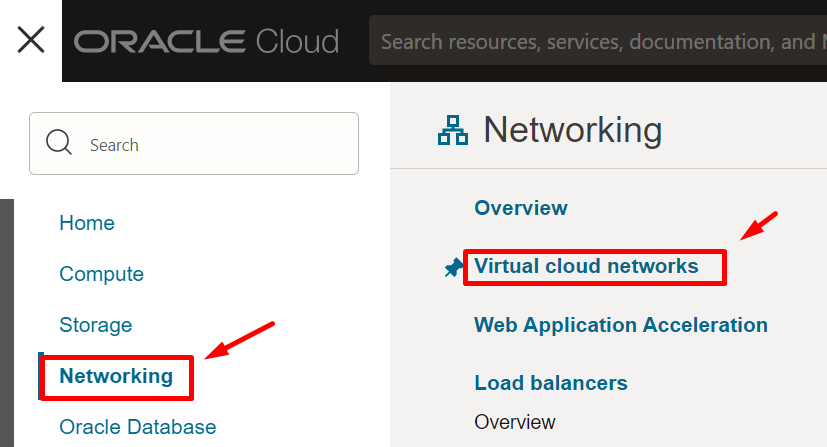

2.	Escolha o compartimento criado no Lab 1: "Compartimento-Trial"

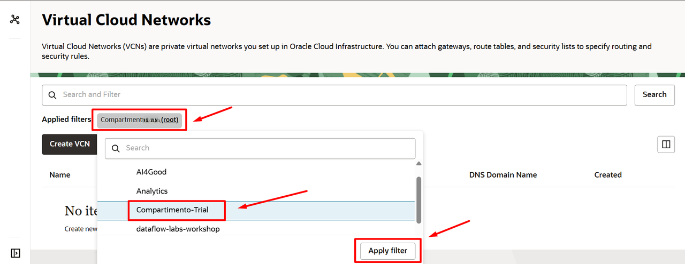

3. Clique em "Start VCN Wizard"

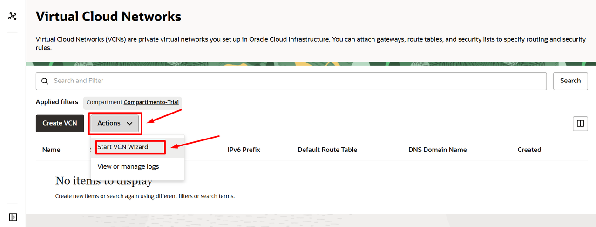

> **Note:** Usando a opção "Start VCN Wizard" você deixa toda a estrutura de rede pronta em menos de 5 minutos.

4. Escolha a primeira opção: "VCN with Internet Connectivity"

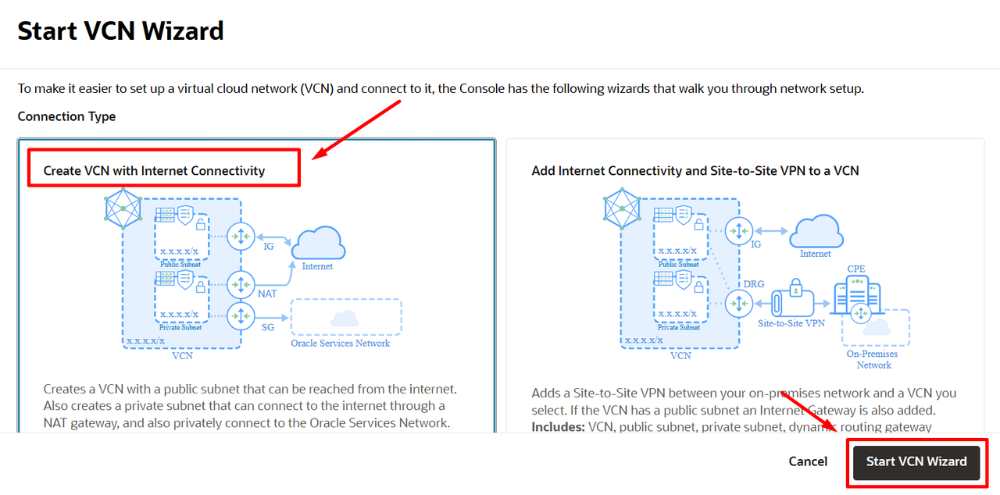

5. Configure os parâmetros básicos da VCN e depois clique em "Next"

* Nome: VCN-TRIAL
* Compartimento: Compartimento-Trial
* VCN CIDR Block: 10.0.0.0/16 
* Sub-rede Pública (Public Subnet): 10.0.0.0/24 
* Sub-rede Privada (Private Subnet): 10.0.1.0/24

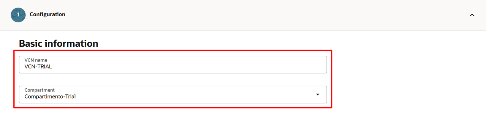
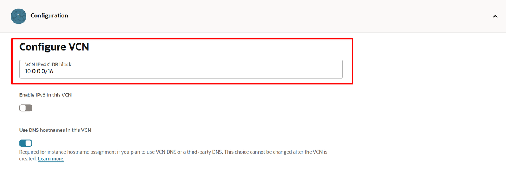
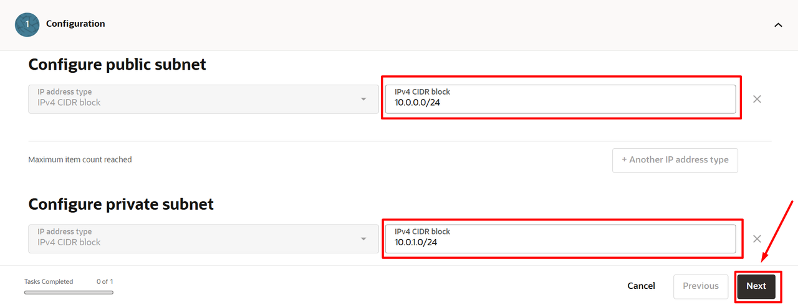

6. Revise os componentes de rede que serão criados e clique em "Create"

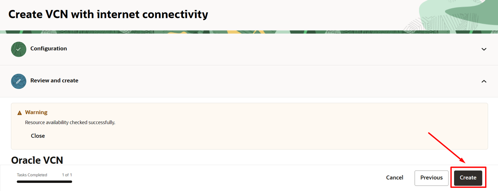

7. Acompanhe o status dos recursos sendo criados e depois clique em "View VCN":

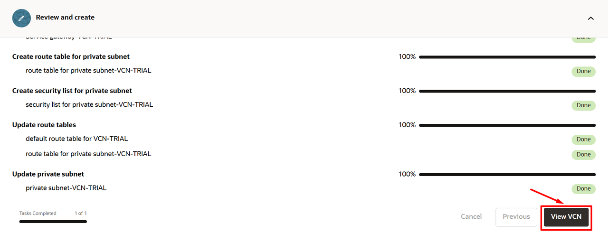

8. Veja que sua VCN foi criada muito rapidamente. Aproveite agora para explorar sua VCN e conferir os recursos que foram criados.

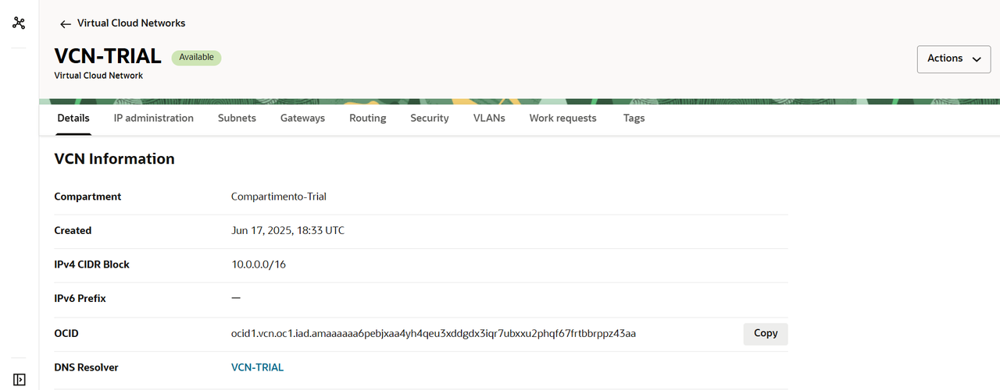

9. Volte um nível para também ver sua VCN em "Virtual Cloud Networks".

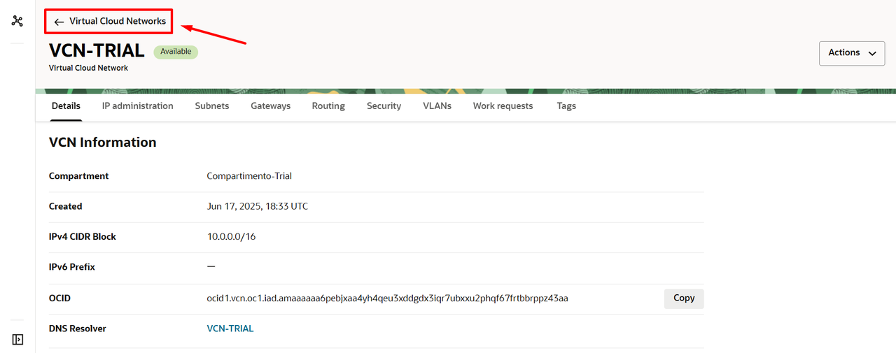

10. Acesse novamente sua VCN.

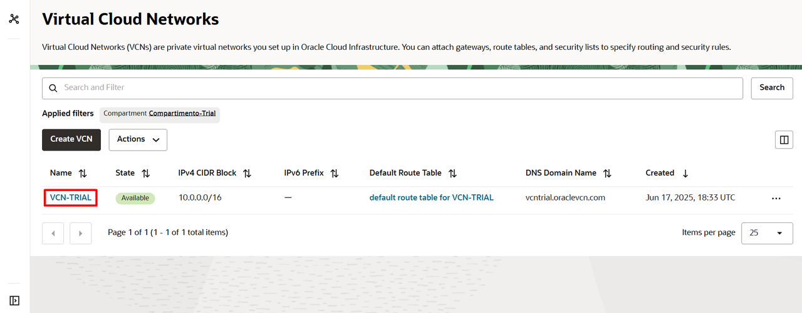

Ao final você deve ter: 1 VCN, 2 sub-redes regionais (pública e privada), 1 Internet Gateway, 1 NAT Gateway e 1 Service Gateway, todos prontos para uso.

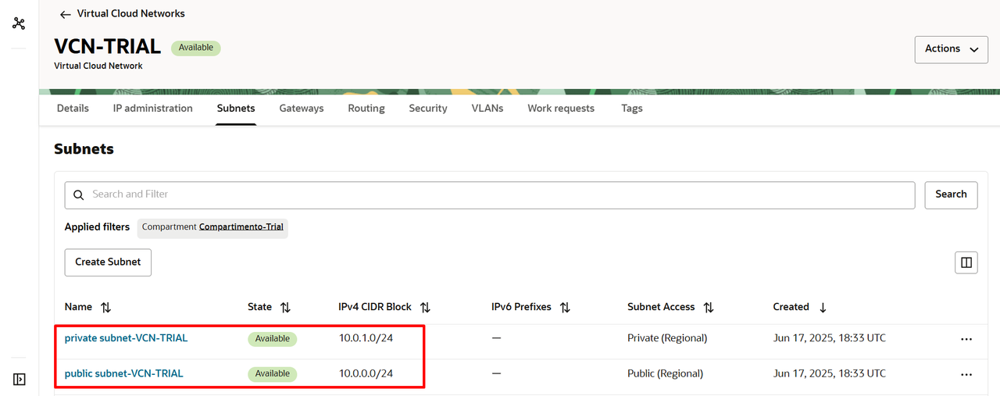

Você pode **seguir para o próximo Lab**.

## Tarefa 2: Liberando portas

Nesta tarefa, você adicionará regras de entrada nas *security lists* criadas para as sub-redes privada e pública.

1. Na página de detalhes da VCN, clique em **Security Lists**.
2. Abra a security list associada à sub-rede privada (**Private Security List**).
3. Em **Ingress Rules**, clique em **Add Ingress Rules** e crie uma regra com os seguintes valores:

   * **Source CIDR:** `10.0.0.0/16`
   * **IP Protocol:** `All Protocols`
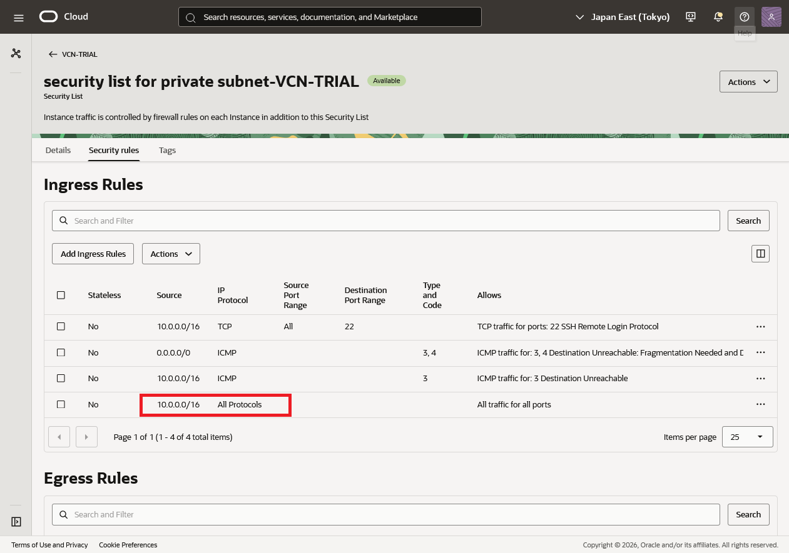

4. Clique em **Add Ingress Rules** para salvar a regra. Ela permite a comunicação por todos os protocolos entre recursos dentro do intervalo de endereços da VCN.
5. Volte para a lista de security lists e abra a security list associada à sub-rede pública (**Public Security List**).
6. Em **Ingress Rules**, clique em **Add Ingress Rules** e crie uma regra com os seguintes valores:

   * **Source CIDR:** `0.0.0.0/0`
   * **IP Protocol:** `TCP`
   * **Destination Port Range:** `80`
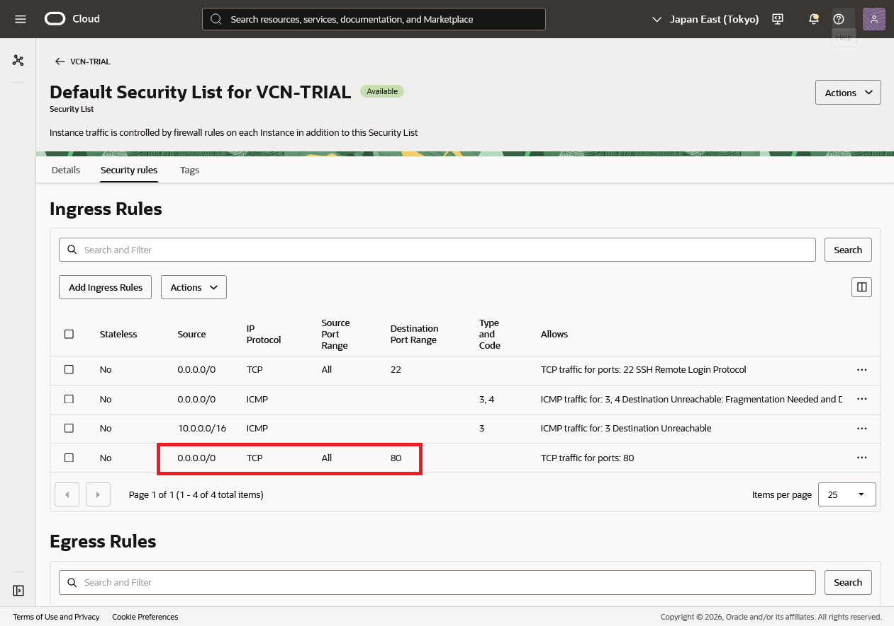

7. Clique em **Add Ingress Rules** para salvar a regra. Essa configuração permite acessos HTTP pela Internet a recursos na sub-rede pública.

> **Importante:** a regra `0.0.0.0/0` libera acesso de qualquer origem. Utilize-a somente para a porta necessária e revise as regras antes de usar recursos em produção.

## Conclusão

Nesta sessão você aprendeu a criar uma Virtual Cloud Network (VCN) na prática.

## Autoria

- **Autores** - Arthur Vianna, Luiz de Oliveira, Thais Henrique
- **Último Updated Por/Data** - Adriano Tanaka/2026
