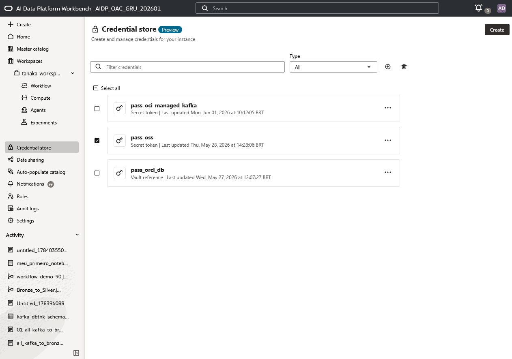
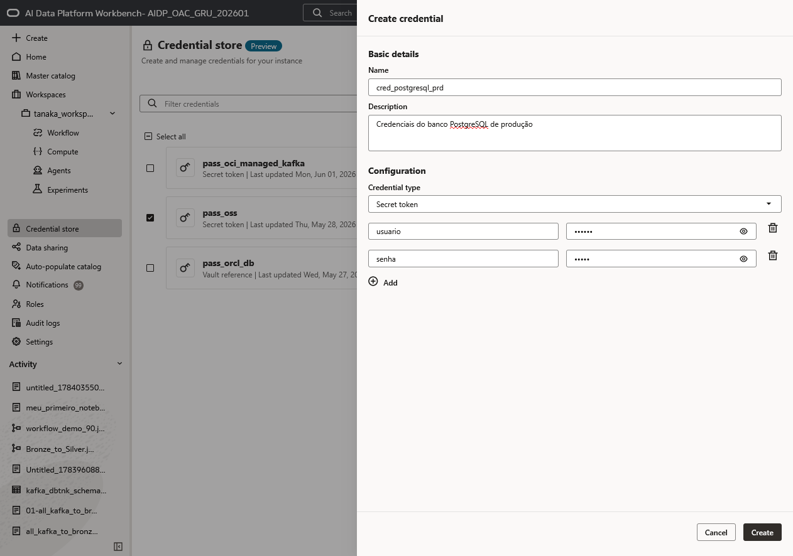
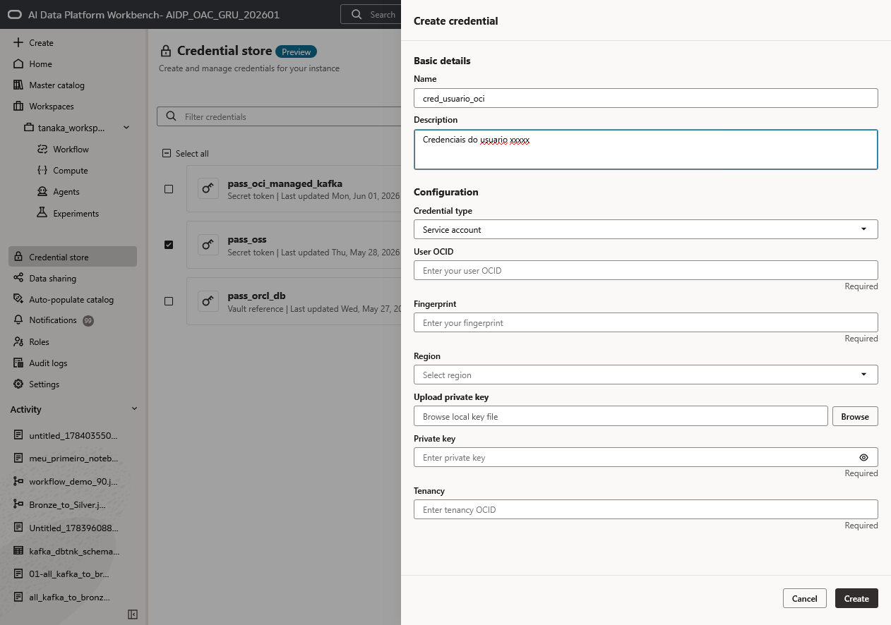
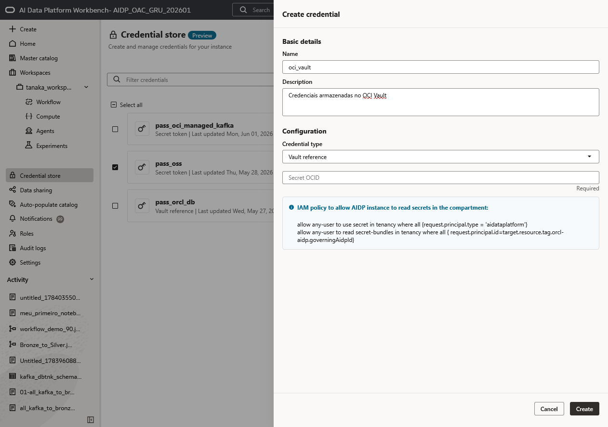
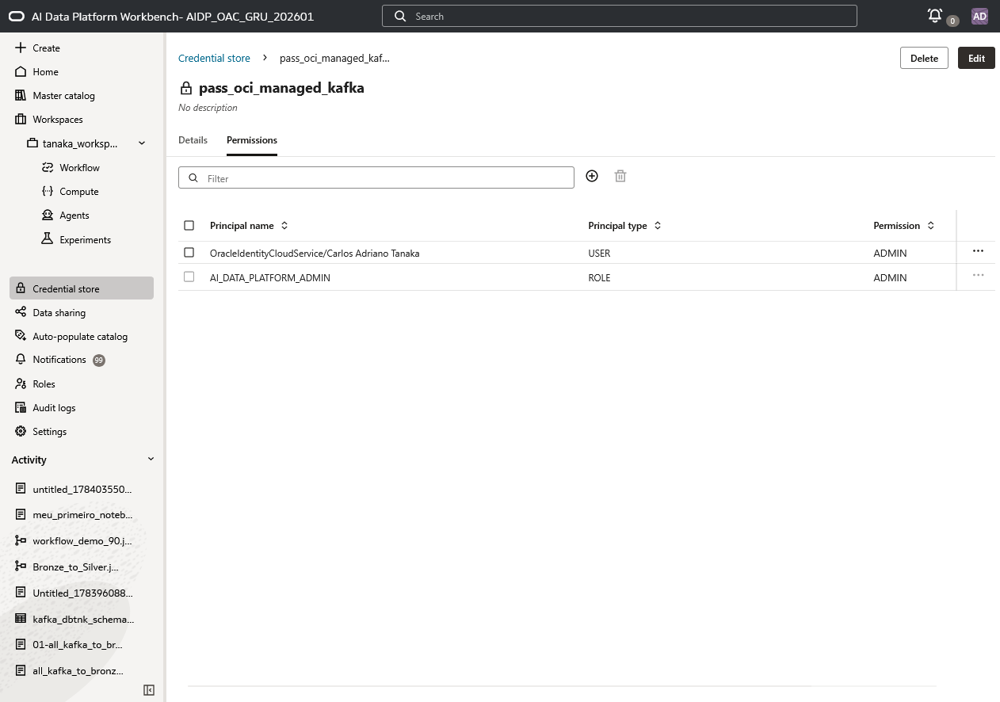
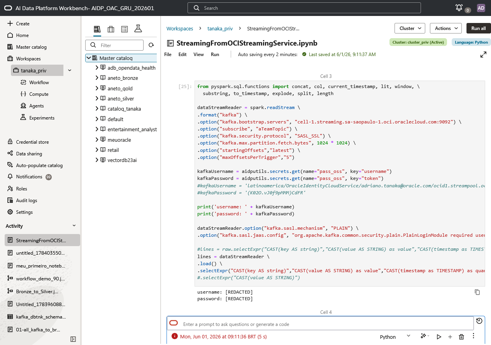

# Armazenar e usar credenciais com segurança no Oracle AIDP

## Introdução

O **Credential Store** do Oracle AI Data Platform (AIDP) é o local central para criar, gerenciar e usar credenciais sem expor senhas, tokens ou chaves privadas em notebooks, jobs e arquivos de configuração. Em vez de gravar um segredo no código, o notebook solicita a credencial pelo nome no momento da execução.

Esse padrão reduz o risco de vazamento, facilita a rotação de segredos e permite controlar quem pode usar cada credencial. O AIDP também registra operações do Credential Store em logs de auditoria e permite administrar permissões por usuário ou papel.

**Tempo estimado:** 15 minutos

### Objetivos

Ao concluir este laboratório, você será capaz de:

* Criar credenciais no Credential Store.
* Escolher o tipo adequado de credencial.
* Referenciar um segredo existente no OCI Vault.
* Controlar o acesso à credencial por permissões.
* Recuperar uma credencial em um notebook sem revelar seu valor.

### Pré-requisitos

* Acesso ao Oracle AI Data Platform Workbench.
* Permissão `CREATE_CREDENTIAL` no nível de Master Catalog para criar credenciais.
* Para uma referência de Vault, um segredo já existente no OCI Vault e políticas IAM que permitam ao AIDP ler esse segredo.
* Um notebook associado a um cluster ativo, para testar o uso da credencial.

## Tarefa 1: conhecer o Credential Store

1. No menu lateral do AIDP Workbench, clique em **Credential store**.
2. A tela exibe as credenciais existentes, seu nome, tipo e a data da última atualização.
3. Use o campo de filtro e a lista **Type** para localizar uma credencial.
4. Clique em **Create** para cadastrar uma nova credencial.

    

O Credential Store é apropriado para chaves, tokens e senhas usados para acessar bancos de dados, APIs, serviços de streaming e outros sistemas externos. Não armazene esses valores diretamente em scripts, notebooks ou repositórios Git.

## Tarefa 2: escolher o tipo de credencial

Na lista **Credential type**, escolha o tipo que corresponde à integração desejada:

* **Secret token**: armazena pares de chave e valor no Credential Store. É útil para tokens de API, nome de usuário e senha, ou credenciais de um serviço externo.
* **Service account**: armazena os dados de uma conta de serviço da OCI. A tela solicita, entre outros campos, **User OCID**, **Fingerprint**, **Region**, chave privada e **Tenancy OCID**.
* **Vault reference**: armazena uma referência a um segredo existente no OCI Vault. O valor secreto permanece no Vault; o AIDP o acessa com segurança em tempo de execução.

> **Recomendação:** para segredos de maior criticidade ou sujeitos a requisitos de conformidade, prefira **Vault reference**. Assim, o valor não é copiado para o AIDP e pode ser gerenciado e rotacionado no OCI Vault.

## Tarefa 3: criar um Secret token

1. Na tela **Credential store**, clique em **Create**.
2. Informe um **Name** claro, por exemplo `cred_postgresql_prd`.
3. Informe uma **Description** que indique o sistema e o ambiente, sem revelar o segredo.
4. Em **Credential type**, selecione **Secret token**.
5. Adicione os pares chave-valor necessários. No exemplo, são usadas as chaves `usuario` e `senha`.
6. Digite os valores secretos nos campos correspondentes e clique em **Create**.

    

Os valores são ocultados no formulário. Use nomes de chave estáveis e descritivos, pois eles serão usados pelo código para recuperar cada componente da credencial.

## Tarefa 4: criar uma credencial Service account

1. Clique em **Create** e informe o nome e a descrição da credencial.
2. Em **Credential type**, selecione **Service account**.
3. Preencha os campos obrigatórios da conta de serviço:

    * **User OCID**;
    * **Fingerprint**;
    * **Region**;
    * chave privada, por upload do arquivo ou preenchimento do campo **Private key**;
    * **Tenancy OCID**.

4. Clique em **Create**.

    

Trate a chave privada como segredo: não a inclua no notebook, em arquivos de texto ou em um repositório. Armazene-a exclusivamente por meio do formulário de credenciais.

## Tarefa 5: referenciar um segredo do OCI Vault

1. Crie previamente o segredo no **OCI Vault**.
2. No Credential Store, clique em **Create** e informe nome e descrição.
3. Em **Credential type**, selecione **Vault reference**.
4. No campo **Secret OCID**, informe o OCID do segredo armazenado no OCI Vault.
5. Confirme que as políticas IAM do compartimento permitem que a instância AIDP leia o *secret bundle*.
6. Clique em **Create**.

    

O AIDP armazena a referência, e não o valor secreto do Vault. Ao executar o notebook, o valor é resolvido de forma segura. Consulte as políticas IAM exigidas na [documentação oficial do Credential Store](https://docs.oracle.com/en/cloud/paas/ai-data-platform/aidug/credential-store1.html#GUID-EFA673B7-7090-40C6-B015-681EC83E3651).

## Tarefa 6: conceder somente o acesso necessário

1. Abra a credencial criada.
2. Acesse a aba **Permissions**.
3. Adicione apenas os usuários ou roles que precisam utilizar a credencial.
4. Atribua o menor nível de acesso necessário e revise os acessos periodicamente.

    

Esse controle evita que qualquer usuário do workspace possa usar um segredo de produção. Quando a credencial não for mais necessária, remova o acesso ou exclua-a pelo menu de ações.

## Tarefa 7: usar a credencial em um notebook

Em um notebook Python, use `aidputils.secrets.get` para recuperar cada item armazenado. O exemplo abaixo recupera as chaves `username` e `token` da credencial chamada `pass_oss`:

```python
kafkaUsername = aidputils.secrets.get(name="pass_oss", key="username")
kafkaPassword = aidputils.secrets.get(name="pass_oss", key="token")

kafka_options = {
    "kafka.sasl.jaas.config": (
        "org.apache.kafka.common.security.plain.PlainLoginModule required "
        f'username="{kafkaUsername}" password="{kafkaPassword}";'
    )
}
```

    

O valor retornado pode ser fornecido a uma conexão, como a configuração de autenticação do Kafka. Entretanto, ele é tratado como sensível: se você tentar imprimi-lo, a saída será exibida como **`[REDACTED]`**, como na imagem. Isso impede que o segredo apareça no resultado do notebook, nos logs visíveis ou em capturas de tela.

> **Importante:** uma credencial pode ser **usada** pelo código em tempo de execução, mas não deve ser revelada por `print`, registrada em logs, concatenada em mensagens de erro ou gravada em arquivos de saída.

Para uma referência de Vault, use a mesma utilidade e informe a chave de referência conforme definido na documentação oficial:

```python
vaultSecret = aidputils.secrets.get(
    name="nome_da_credencial_vault",
    key="VaultSecretReference"
)
```

## Boas práticas

* Não codifique segredos diretamente em notebooks, scripts, parâmetros de job ou arquivos de configuração.
* Adote nomes que indiquem o serviço e ambiente, como `kafka-prod-token` ou `postgresql-dev`.
* Separe credenciais de desenvolvimento, homologação e produção.
* Conceda acesso pelo princípio do menor privilégio e revise a aba **Permissions** regularmente.
* Prefira referências ao OCI Vault para segredos críticos e faça a rotação periódica de tokens e chaves.
* Verifique o histórico e os logs de auditoria para acompanhar criação, alteração, exclusão e uso das credenciais.

## Conclusão

Você pode usar o Credential Store para retirar segredos do código e disponibilizá-los com controle de acesso para notebooks, jobs e workflows. Escolha **Secret token**, **Service account** ou **Vault reference** de acordo com o caso de uso; recupere a credencial com `aidputils.secrets.get`; e mantenha os valores protegidos — eles podem ser usados pela aplicação, mas permanecem mascarados quando há tentativa de exibição.

## Saiba mais

* [Credential Store (Preview) — Oracle AI Data Platform](https://docs.oracle.com/en/cloud/paas/ai-data-platform/aidug/credential-store1.html#GUID-EFA673B7-7090-40C6-B015-681EC83E3651)
* [Oracle AI Data Platform](https://www.oracle.com/database/ai-data-platform/)
