# Instalar os notebooks de ingestão

## Introdução

Neste laboratório, você preparará o Oracle AI Data Platform Workbench para executar os notebooks de ingestão e transformação do fluxo de dados. Esta etapa conecta o OCI Database with PostgreSQL ao ambiente de processamento do AIDP, instala o driver JDBC necessário no cluster compute e organiza os recursos usados para persistir os dados nas camadas Bronze e Silver.

Você configurará as variáveis de ambiente no cluster compute, criará o catálogo e os schemas utilizados pelo laboratório, fará o upload dos notebooks no workspace e executará manualmente o notebook de ingestão Bronze. Ao final, os dados transacionais do PostgreSQL estarão carregados na camada Bronze em formato Delta, prontos para as transformações seguintes.

### Objetivos

- configurar as variáveis de ambiente usadas pelos notebooks;
- instalar o driver JDBC do PostgreSQL no cluster compute;
- iniciar o cluster compute que executará os workloads PySpark;
- criar o catálogo do laboratório no Master catalog;
- criar os schemas `bronze` e `silver`;
- fazer upload dos notebooks no workspace do AIDP;
- executar manualmente o notebook de ingestão Bronze;
- validar a gravação inicial dos dados transacionais na camada Bronze.


## Tarefa 1: Configurar as variáveis de ambiente e subir o cluster

Antes de iniciar, baixe os arquivos que serão utilizados nesta etapa:

- [postgresql-42.7.4.jar](assets/postgresql-42.7.4.jar)

1. No workspace do AIDP, acesse **Compute** para visualizar o cluster que será utilizado pelos notebooks.

    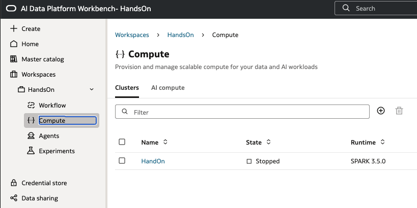


2. Abra o menu de ações do cluster para acessar as opções disponíveis.

    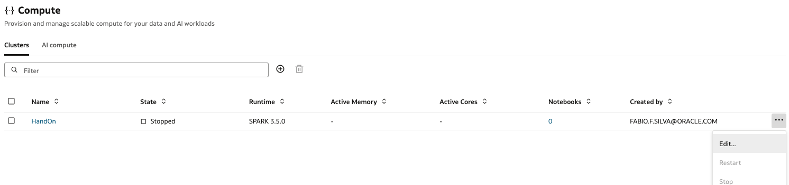

3. Edite o cluster e configure as variáveis de ambiente necessárias para conexão com o PostgreSQL e gravação das camadas Bronze, Silver e Gold.

    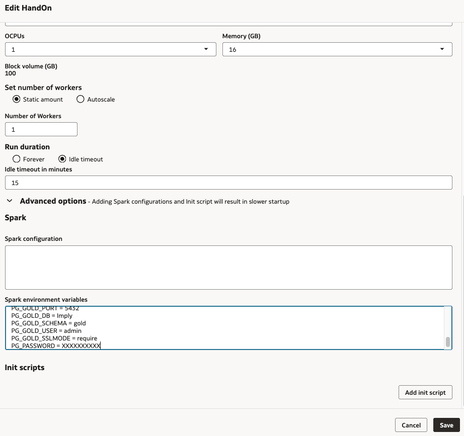

    ```
    AIDP_CATALOG = handson
    BRONZE_SCHEMA = bronze
    SILVER_SCHEMA = silver
    BRONZE_WRITE_MODE = overwrite
    SILVER_WRITE_MODE = overwrite
    PG_HOST = ENDPOINT_DO_SEU_POSTGRESQL.oci.oraclecloud.com
    PG_PORT = 5432
    PG_DB = handson
    PG_SCHEMA = public
    PG_USER = pgadmin
    PG_SSLMODE = require
    PG_GOLD_HOST = ENDPOINT_DO_SEU_POSTGRESQL.oci.oraclecloud.com
    PG_GOLD_PORT = 5432
    PG_GOLD_DB = handson
    PG_GOLD_SCHEMA = gold
    PG_GOLD_USER = pgadmin
    PG_GOLD_SSLMODE = require
    PG_PASSWORD = SENHA_DO_SEU_POSTGRESQL
    ```

4. Acesse a aba **Library** do cluster para instalar o driver JDBC do PostgreSQL.

    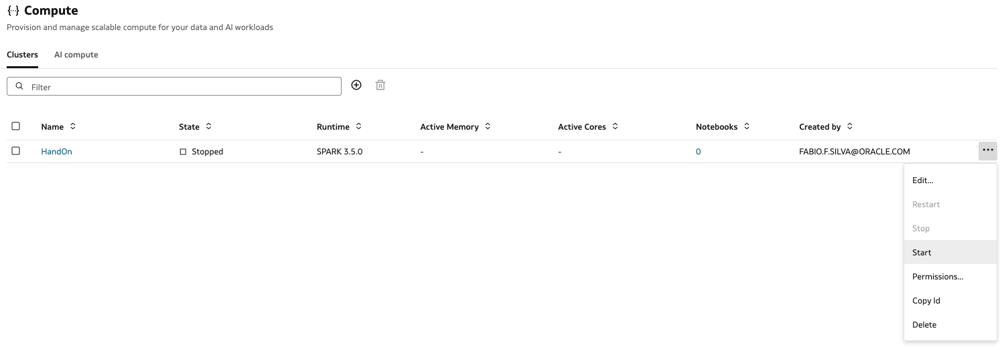

5. Faça upload do arquivo `postgresql-42.7.4.jar` baixado anteriormente.

    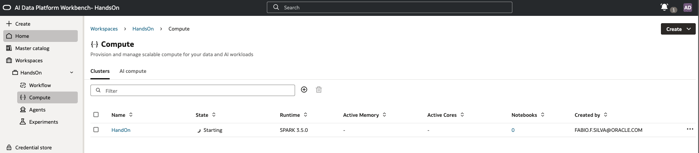

6. Confirme que a biblioteca foi adicionada ao cluster.

    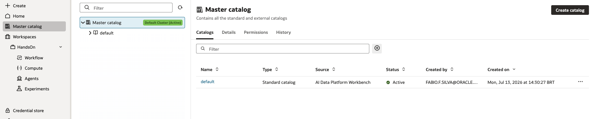

7. Abra novamente o menu de ações do cluster e selecione a opção para iniciar o compute.

    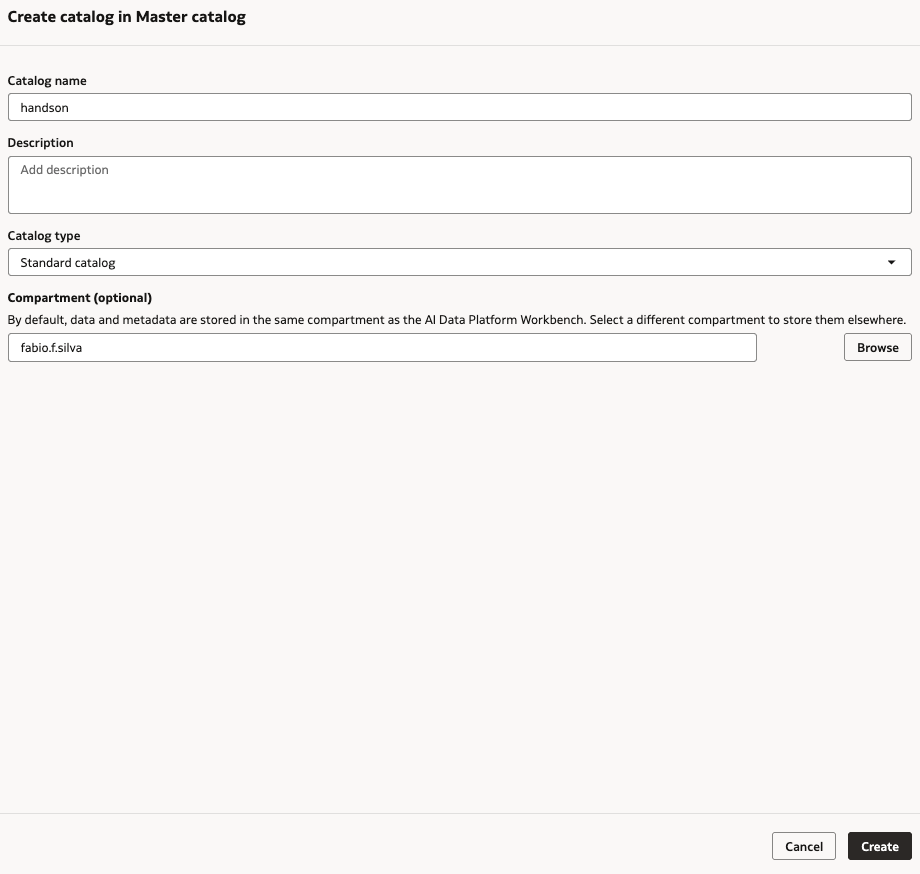

8. Aguarde até que o cluster entre em estado de inicialização ou execução antes de iniciar os notebooks.

    

## Tarefa 2: Criar o catálogo e schemas

1. No menu lateral do Workbench, acesse **Master catalog**.

    

2. Clique em **Create catalog** e informe os dados do catálogo que será utilizado no laboratório.

    

3. Confirme que o catálogo foi criado com sucesso.

    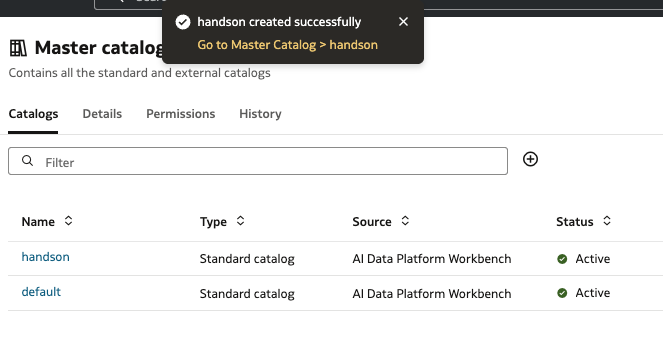

4. Acesse o catálogo criado e visualize a lista de schemas.

    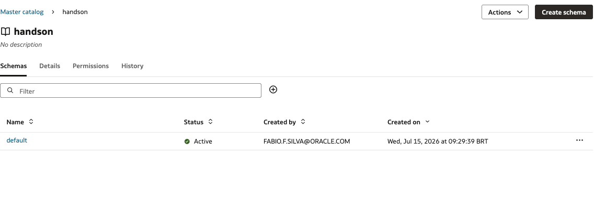

5. Clique em **Create schema** e crie os schemas necessários para as camadas do laboratório.

    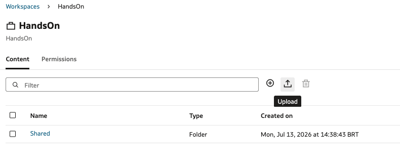

6. Confirme que os schemas `bronze` e `silver` foram criados e estão ativos.

    

## Tarefa 3: Fazer upload dos notebooks e executar manualmente

Antes de iniciar o upload, baixe os arquivos que serão utilizados nesta etapa:

- [01_bronze_ingestao_postgresql_delta.ipynb](assets/01_bronze_ingestao_postgresql_delta.ipynb)
- [02_silver_transformacoes_delta.ipynb](assets/02_silver_transformacoes_delta.ipynb)
- [03_gold_publicacao_postgresql.ipynb](assets/03_gold_publicacao_postgresql.ipynb)

1. No menu lateral, acesse **Workspaces** e selecione o workspace do laboratório.

    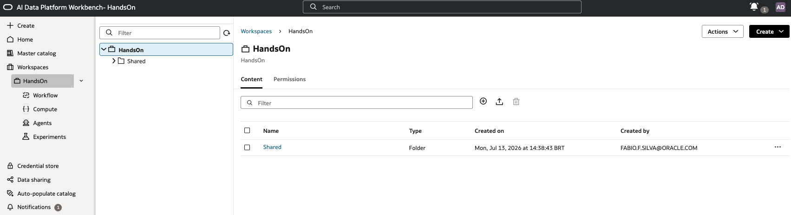

2. No conteúdo do workspace, clique em **Upload** para enviar os notebooks.

    

3. Selecione os notebooks de ingestão e transformação que serão utilizados no laboratório.

    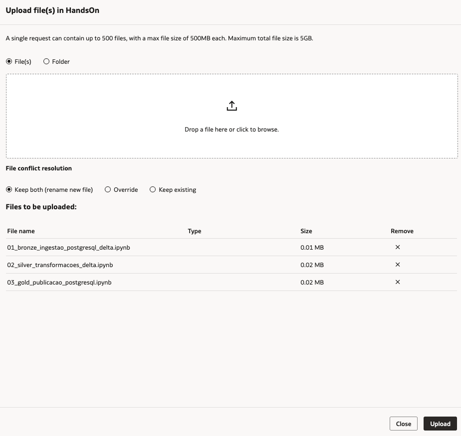

4. Confirme que os notebooks foram enviados e aparecem na lista de conteúdo do workspace.

    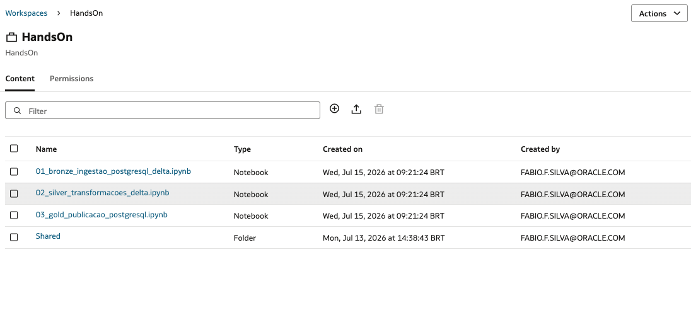

5. Abra o notebook de ingestão Bronze e selecione o cluster compute configurado anteriormente para executar as células.

    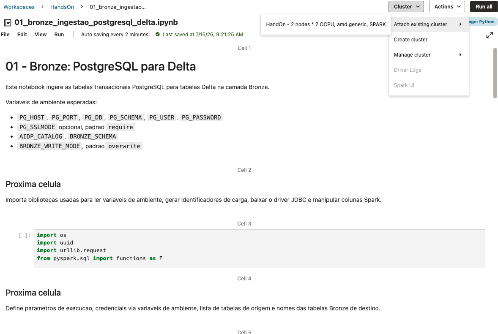

6. Execute as células do notebook e acompanhe a ingestão das tabelas PostgreSQL para a camada Bronze.

    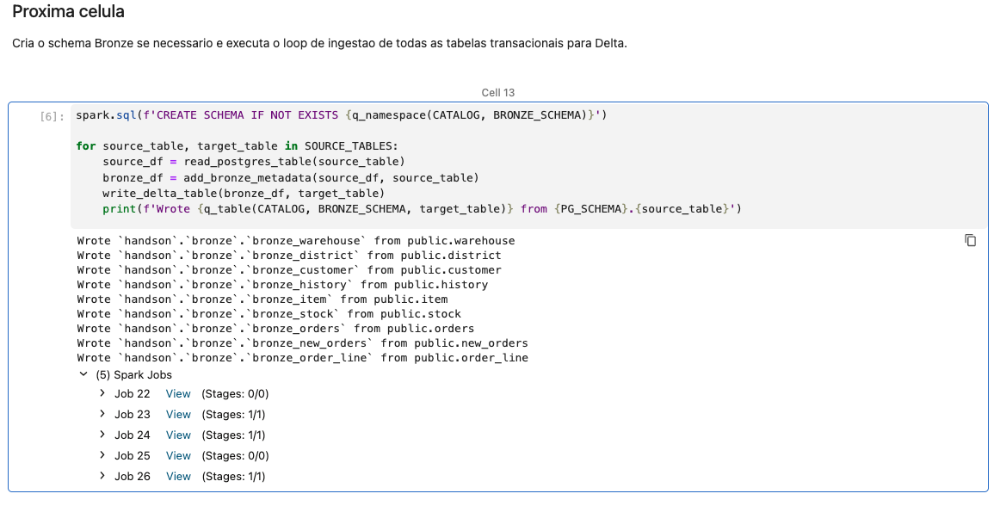

## Conclusão

Nesta etapa, você configurou o ambiente de execução dos notebooks no Oracle AI Data Platform Workbench. O cluster compute recebeu as variáveis necessárias para acessar o PostgreSQL, instalou o driver JDBC e foi iniciado para executar os workloads PySpark do laboratório.

Você também criou o catálogo e os schemas que serão usados pelas tabelas Delta, disponibilizou os notebooks no workspace e executou a ingestão Bronze. Com isso, os dados transacionais foram carregados na camada Bronze e o ambiente está preparado para seguir com as transformações da camada Silver.

## Autoria

- **Autores** - Adriano Tanaka, Fábio Silva
- **Último Updated Por/Data** - Fábio Silva, Jul/2026
