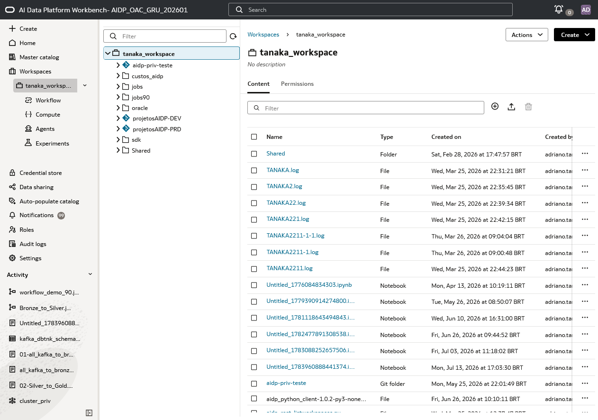
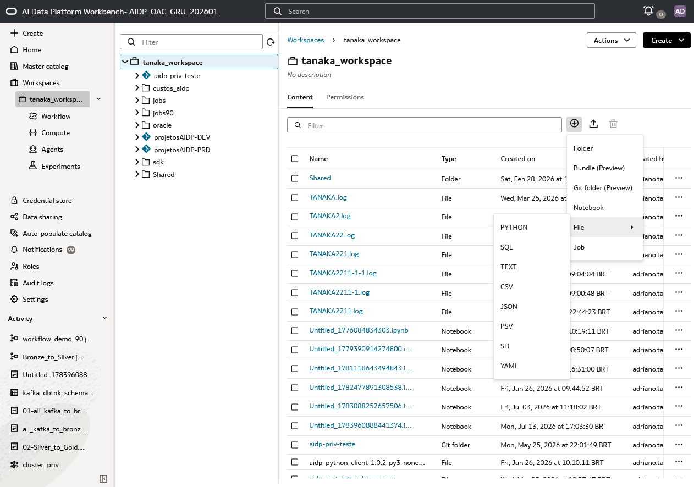
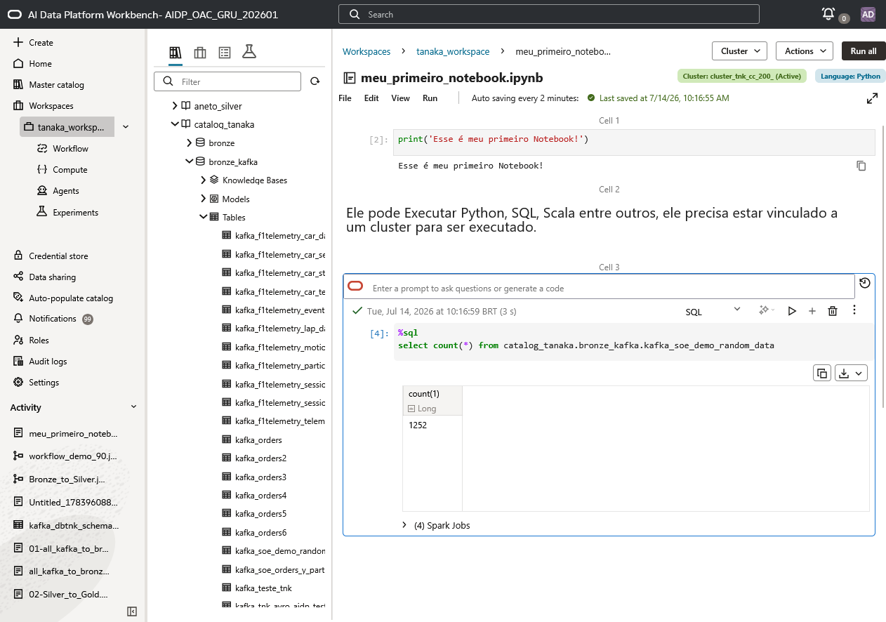

# Trabalhar com Python Notebooks no Oracle AI Data Platform (AIDP)

## Introdução

O Oracle AI Data Platform (AIDP) permite armazenar e organizar diferentes tipos de conteúdo no **workspace**. Além de notebooks, é possível trabalhar com pastas, arquivos de código, arquivos de configuração e arquivos de dados. Dessa forma, o workspace funciona como a área central para manter scripts, consultas, dados auxiliares e artefatos do projeto organizados.

Neste laboratório, você conhecerá essa organização e criará um **Python Notebook** para escrever e executar comandos e scripts. Um notebook divide o trabalho em células independentes: algumas contêm código executável e outras podem documentar o raciocínio, as instruções e os resultados.

**Tempo estimado:** 10 minutos

### Objetivos

Ao concluir este laboratório, você será capaz de:

* Identificar os tipos de conteúdo aceitos em um workspace AIDP.
* Organizar materiais do projeto em diretórios.
* Criar um notebook com Python como linguagem padrão.
* Executar comandos Python e SQL a partir do notebook.
* Usar células Markdown para documentar o conteúdo técnico.

### Pré-requisitos

* Acesso ao Oracle AI Data Platform Workbench e a um workspace.
* Permissão para criar arquivos e notebooks no workspace.
* Um cluster ativo para executar células de código.

## Tarefa 1: conhecer os tipos de conteúdo do workspace

1. No menu lateral, clique em **Workspaces** e abra o workspace em que deseja trabalhar.
2. Observe a árvore de diretórios à esquerda e a lista de conteúdos no painel principal.
3. Use pastas para separar os artefatos por assunto, equipe, ambiente ou etapa do pipeline — por exemplo, `dados`, `notebooks`, `scripts`, `jobs` e `configuracoes`.

    

No exemplo, o workspace contém diferentes tipos de itens, como **Folder**, **File**, **Notebook** e **Git folder**. Essa estrutura permite manter o projeto navegável mesmo quando ele inclui muitos arquivos e notebooks além de permitir configurações de acesso.

## Tarefa 2: criar e organizar arquivos

1. Abra o diretório em que o novo item deve ser criado.
2. Clique em **Create** e escolha o tipo de conteúdo.
3. Para criar uma pasta, escolha **Folder** e informe um nome que deixe clara a finalidade do diretório.
4. Para criar um arquivo, escolha **File** e selecione o formato apropriado.

    

O AIDP aceita arquivos de diferentes naturezas, incluindo:

* **PYTHON** para scripts Python.
* **SQL** para consultas e comandos SQL.
* **TEXT** para arquivos de texto simples.
* **CSV**, **JSON** e **PSV** para dados estruturados ou delimitados.
* **SH** para scripts de shell.
* **YAML** para arquivos de configuração.

Também é possível criar **Notebook**, **Job**, **Bundle (Preview)** e **Git folder (Preview)**. Prefira diretórios com nomes consistentes e evite salvar notebooks sem nome; isso facilita a reutilização em jobs e a manutenção do projeto.

## Tarefa 3: criar um Python Notebook

1. No diretório desejado, clique em **Create** e selecione **Notebook**.
2. Informe um nome descritivo, por exemplo `meu_primeiro_notebook`.
3. Abra o notebook criado.
4. No seletor de cluster, no canto superior direito, escolha um cluster ativo antes de executar as células.

O notebook é criado com **Python** como linguagem padrão, indicada pela etiqueta **Language: Python**. Portanto, uma célula comum de código interpreta os comandos como Python.

    

5. Em uma célula de código, escreva um comando Python simples, como:

    ```python
    print('Esse é meu primeiro Notebook!')
    ```

6. Execute a célula pelo botão de execução da própria célula ou pelo comando **Run all** para executar todas as células do notebook.

> **Importante:** o notebook precisa estar vinculado a um cluster para executar código. O status do cluster é exibido no cabeçalho do notebook.

## Tarefa 4: usar outras linguagens em células do notebook

Embora Python seja a linguagem padrão do notebook no exemplo, o AIDP permite trabalhar também com **SQL** e **Scala**. A linguagem pode ser escolhida para uma célula ou ativada com um comando mágico, conforme a necessidade.

Para executar uma consulta SQL em uma célula de um notebook Python, inicie a célula com `%sql`:

```sql
%sql
SELECT count(*)
FROM catalog_tanaka.bronze_kafka.kafka_soe_demo_random_data;
```

No exemplo, a célula é identificada como **SQL** e retorna o resultado da consulta diretamente no notebook. Use esse padrão para alternar entre preparação de dados em Python e consultas SQL no mesmo fluxo de análise.

> **Dica:** escolha Python para scripts, integrações e tratamento de dados; SQL para consultas e transformações declarativas; e Scala quando seu código ou bibliotecas Spark exigirem essa linguagem.

## Tarefa 5: documentar o notebook com Markdown

Além de código, notebooks devem explicar o que está sendo feito. Para isso, adicione uma célula e altere seu tipo para **Markdown**.

Use Markdown para incluir:

* Títulos e subtítulos para separar etapas.
* Explicações sobre fontes, regras de negócio e parâmetros.
* Listas de validações ou instruções de execução.
* Links, trechos de código e observações importantes.

Exemplo de conteúdo para uma célula Markdown:

```markdown
## Validação da ingestão

Esta etapa verifica a quantidade de registros carregados na camada Bronze.
Execute a célula SQL abaixo após concluir a ingestão.
```

As células Markdown não exigem cluster nem são executadas como código. Elas transformam o notebook em um documento técnico reproduzível, combinando contexto, instruções, comandos e resultados em um único lugar.

## Conclusão

Você conheceu a organização de conteúdos no workspace AIDP e criou a base para trabalhar com Python Notebooks. Use diretórios para estruturar os artefatos do projeto, Python como linguagem padrão para comandos e scripts, SQL ou Scala quando apropriado e Markdown para documentar cada etapa do processo.

## Saiba mais

* [Oracle AI Data Platform](https://www.oracle.com/database/ai-data-platform/)
* [Oracle LiveLabs](https://livelabs.oracle.com/)
